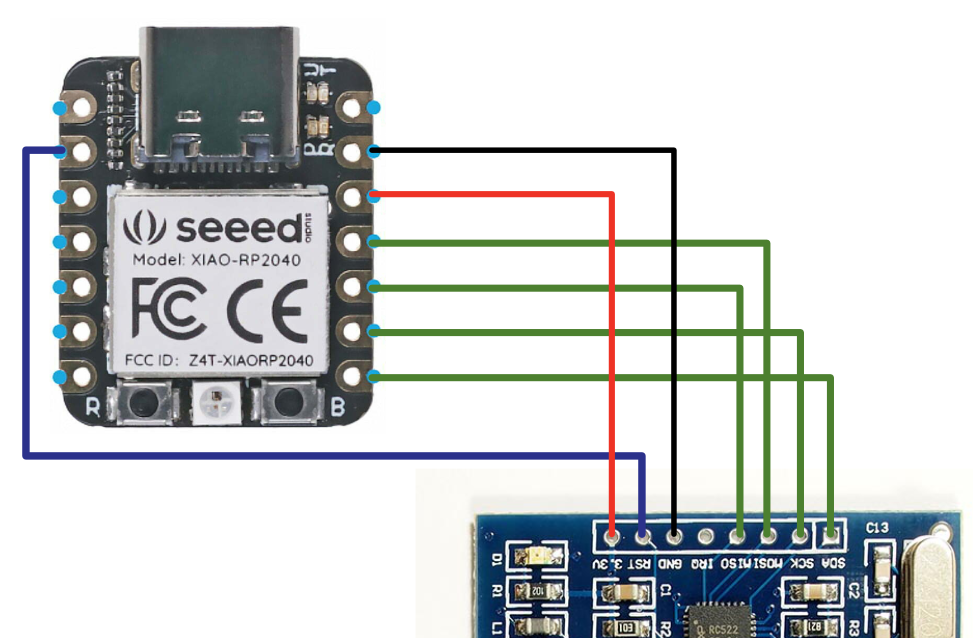

# CircuitPython NFC

Using a **RC522 RFID Module** with **CircuitPython** on a **Seeed XIAO RP2040**.

Tested with and build for **Mifare Classic 1k** cards.

With code from <https://github.com/domdfcoding/circuitpython-mfrc522>.

## Pin diagram

## NFC research

### Documents

NOTE: I do not own any of the following documents. They have been included in this repository for reference only and are available on the internet.

- [Mifare Classic datasheet](documentation/AN1305.pdf)
- [Mifare Classic 1k datasheet](documentation/MF1S50YYX_V1.pdf)
- [NDEF summary](documentation/NDEF.pdf)

### NFC Default Access Keys

| Description      | Key A             | Key B             |
| ---------------- | ----------------- | ----------------- |
| Default          | FF FF FF FF FF FF | FF FF FF FF FF FF |
| NDEF sector 1    | A0 A1 A2 A3 A4 A5 | FF FF FF FF FF FF |
| NDEF sector 2-15 | D3 F7 D3 F7 D3 F7 | FF FF FF FF FF FF |
